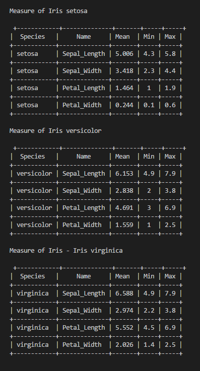
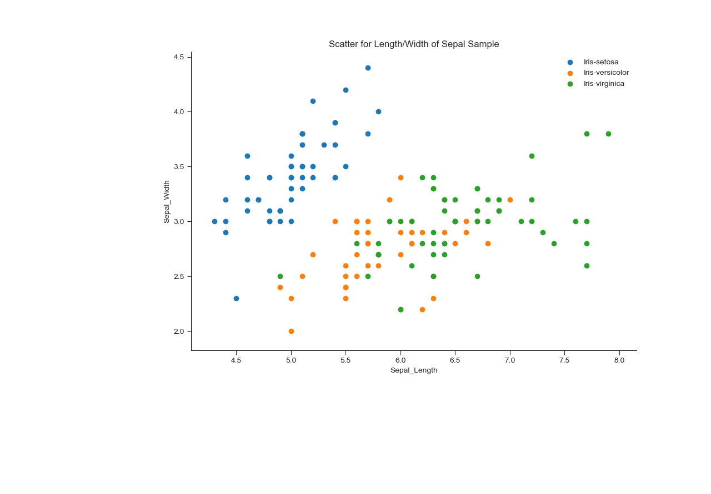
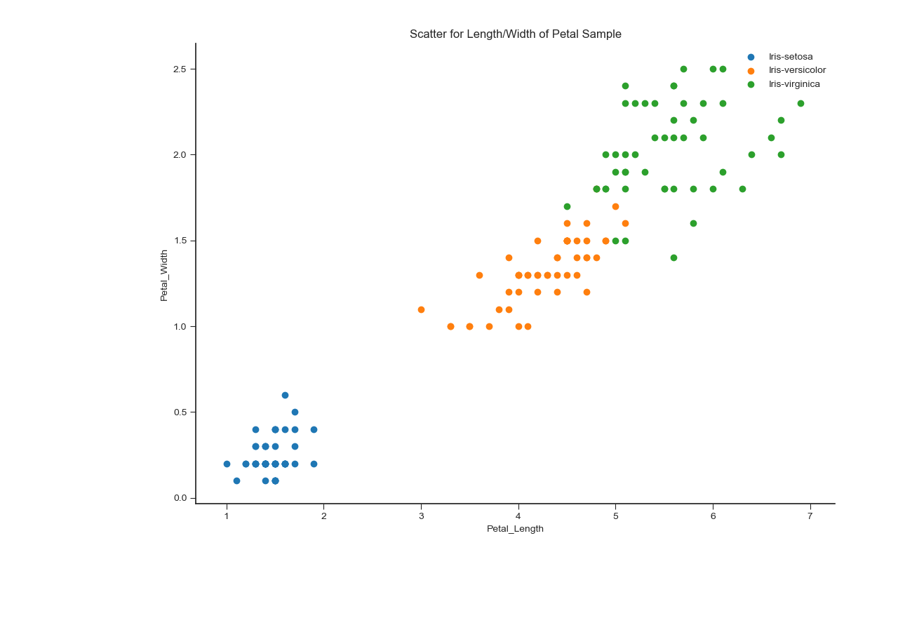

## IrisProject2018 Programming and Scripting Module Project

## Introduction
This project sets out to investigate the "Iris Dataset" using Python code learnt in the Module, and also to demonstrate that as the research progressed, new tools and functionality commonly used in Data Science/ Data Analyitics workings were highlighted and introduced to the workings.

Initially python coding was used to calculate and display basic staistics on the dataset and pushing output to print/file output in a Tabular format. (used Mean, Min, Max as sample indicators of significant attributes)...

Through further reaserch I have discovered Pandas, Numpy, Mathplotlib and seaborn as useful and more effective/efficient means of data mining as well as producing a highly effective visualistion of the data.

The drill down on the datasets and resultant graphics make it evident there are attributes to the species or Iris that indicate common groupings or "clusters" that lend themselves as predictors of species type dependent on the characteristics of the 4 variables.
It is clear why the Iris data set is commonly used as sample data to demonstrate Machine learning and related theories

1. Research background information about the data set and write a summary about it.2. Keep a list of references you used in completing the project.
3. Download the data set and write some Python code to investigate it.

4. Summarise the data set by, for example, calculating the maximum, minimum and mean of each column of the data set.
l  A Python script will quickly do this for you.
5. Write a summary of your investigations. 
#6. Include supporting tables and graphics as you deem necessary.

What does examining a data set entail
 How can Python be used?

A Present Write up and code

"Data Science or data analysis is theprocess of analyzing a large dset of data points to get answers on questions related to tht data"
m
Ref: https://www.youtube.com/watch?v=CmorAWRsCAw
#
README
 Summary of Data Set
Investigations into Data Set
Document how to run the Python code used to investigate the data set

Clearly document what the code does
S

### Background Information.
The Iris Dataset is a sample of data collected at the time for  R.A. Fisher's 1936 paper, "The Use of Multiple Measurements in Taxonomic Problems". Ref the data set contains measures of 4 variables on 3 Species of the Iris plant(Iris setosa, Iris virginica and Iris versicolor). The four measures are: the length and the width of the sepals and petals, in centimetres. (https://en.wikipedia.org/wiki/Iris_flower_data_set). The sample size is 150.

##### So in summary:
1. Sample Size = 150
m2. Variables measured ("Inputs") = 4 (length and the width of the sepals and petals, in centimetres)3. Species ("Outputs") = 3 ...setosa, versicolor, virginica

### Inital Findings/Observations.
first.py  pulled the Irsidata set from a csv file and calculated out the Mean,Min,Max,Mode and Standard Deviations for each of the 4 variables at a top level and for each of the Species. The output file for this is kkkkkkk.txt (link)

##### Table 1:Measures of Variables

 
After discovering the Numpy & Panda modules, I was able to pull the required data in a much cleaner manner. 
 
##### Sepal Length
PSpecies|Mean|Min|Max|StDev|
---|---|---|---|---|
Iris-setosa|	5.006|	4.3	|5.8|0.3524
Iris-versicolor|	5.936|	4.9|	7|0.5161
Iris-virginica|	6.588|	4.9	|7.9|0.6358

##### Sepal Width
Species|Mean|Min|Max|StDev|
---|---|---|---|---|
Iris-setosa|	3.418|	2.3|	4.4|0.3810
Iris-versicolor|	2.77|	2	|3.4|0.3137
Iris-virginica	|2.974|	2.2|	3.8|0.3224

###### Petal Length
Species|Mean|Min|Max|StDev|
---|---|---|---|---|
Iris-setosa|	1.464|	1	|1.9|0.1735
Iris-versicolor|	4.26	|3	|5.1|0.4699
Iris-virginica	|5.552|	4.5|	6.9|0.5518

###### Petal Width
Species|Mean|Min|Max|StDev|
---|---|---|---|---|
Iris-setosa|	0.244|	0.1|	0.6|0.1072
Iris-versicolor|	1.326|	1	|1.8|0.1977
Iris-virginica|	2.026	|1.4|	2.5|0.2746

A As a first pass review of the data output one can make certain observations to prompt further rview

Sepal: Average Lenget of the setosa is generlly smaller that versicolr and virginica, which are close in measure 
The oppisite applies o the Sepal Widths. In this case the data shows setosa to be signigicantly wider that both alternatives
... setosa petal shown to be "short and wide", while the other 2 are "long and narrow"

Petals: The average length of setosa is significantly shorter at a maximum lenght of 1.9cm. In contrast the shortest of verisolcor and virginica are substantially longer that the setosa at 3cm and 4.5cm respectively.
Also the width od the setosa species is heavily contrasted to its fellow Iris species.
.... setosa id both substantially shorter and nawwower that V&V

Producing Visualisations of the data measure further helps demonstate the gaps in relative size.
Data visualisation is very important in that it is use continuously to explore the data set and prodive useful insights and to share them in a n effective way.Producing Visualisations of the data measure further helps demonstate the gaps in relative size

Hoey (footnote) (Statistical Analysis of the Iris Flower Dataset, University of Massachusetts At Lowell )
http://patrickhoey.com/downloads/Computer_Science/03_Patrick_Hoey_Data_Visualization_Dataset_paper.pdf
His data clearly demonstrates this

Linke t graphs

Sepal length :virginica has the longest sepals,versicolor the medium length and setosa has the shortest
Sepal width:setosa has the widest sepals,virginica the medium and versicolor has the narrowest of sepals 

Petal length: virginica has the longest petals, versicolor the medium length, and setosa has the shortest petals
... as hoey also points out the "points are partitioned pretty 	cleanly with little overlap" (Hoey)

Petal width :Iris-Virginica has the widest petals, versicolor medium width,setosa the narrowest petals when compared to the other classes. 

The goal of a discriminant analysis is to produce a simple function that, given the four measurements, will classify a flower correctly. This is the beginning of creating “predictors” in order to try to make a more educated guess on a record in a dataset.

Based on the feature of the 4 variables, Fisher developed a Linear dicriminant model to distinguish the species from eachother.
In "Linear Discriminant Analysis for Machine Learning"(1) By Jason Brownlee on April 6, 2016 in Machine Learning Algorithms (https://machinelearningmastery.com/linear-discriminant-analysis-for-machine-learning/) The (bold)Linear discriminant analysis (LDA) is seen as the preferred linear classification technique where you have more than two classes. Statistical data derived from available data is used to make predictions based on LDA equations based on certain assumptions. The statistical tools uses already known groups assignments "to assign objects to one group among a number of groups.(2)
e
(2)https://www.researchoptimus.com/article/what-is-descriminant-analysis.php

The data set is used demonstrating machine learning is what is described as "Supervised Learning". There is a clear relationship between the known input data available and the expected outputs.

Assumptions..

"That your data is Gaussian, that each variable is is shaped like a bell curve when plotted.
That each attribute has the same variance, that values of each variable vary around the mean by the same amount on average."

T

It is apparent that this data set is commmonly used as sample data inputted to demonstrate "machine learning" and Predictive Data analyitics.

An inital review of the data shows that the characteristics of the Iris-setosa are distinct in measurements from the Iris-versicolor and virginica.

The analysis of the data and use of graphs gives useful insight to the characteristics of the 3 species of Iris.An inital review of the data shows that the characteristics of the Iris-setosa are distinct in measurements from the Iris-versicolor and virginica.

The key to good data analyitics it is argued is that stored inforamtion is most useful in that it is used to produce new information (Cokins)... it the case of the Iris, the various lenghts , widths etc. of a given petal should "predict" what particular species of the plant is at hand.

"in comparing methods old and new, and in evaluating any method, it is often considered helpful to try them out on known datasets, thus maintaining some continuity in how we assess methods"
https://stats.stackexchange.com/questions/74776/what-aspects-of-the-iris-data-set-make-it-so-successful-as-an-example-teaching

References:Examples and tutorials on how to create histograms and Scatterplots. Based on researching the Data Set the scattergram type graphs are effective illustrations for the 3 different Species of Iris speciments.

1 https://matplotlib.org/tutorials/introductory/sample_plots.html#sphx-glr-tutorials-introductory-sample-plots-py

Background on Iris Data Set
https://en.wikipedia.org/wiki/Iris_flower_data_set

In the course of working through Python coding to interogate teh data for trends in the data and through researching available functions , modules etc . that surfaced during that effort, it has become apparent there are numerous modules and Python "Add-ons" that make the Data Analysis effort much easier and User friendly for the beginner "Programmer". Inital attempts to calculate the Statistical measures were "clumsy"... lenghty code and messy looking data tables.
It became quickly apparent to me that running a Histogram for all the data combined does not add significant value, only comparisons between the Species and their characterisics demonstartes the relationships and groupings of measures bedendent on the variables.

This project has introduced the need to become familiar with Data Analysis tools supported by Python such as Numpy, Pandas,
matplotlib.pyplot, and seaborn. In order to improve the apparance of outputted data I have come accross modules that helped in various searches and tuturials online....beauti

"Data Visualisation (https://machinelearningmastery.com/machine-learning-in-python-step-by-step/)
We are going to look at two types of plots:Univariate plots to better understand each attribute.
Multivariate plots to better understand the relationships between attributes.
We start with some univariate plots, that is, plots of each individual variable.... Raw data is Numeric... Histograms
 
 Multivariate Plots
Now we can look at the interactions between the variables.
First, let’s look at scatterplots of all pairs of attributes. This can be helpful to spot structured relationships between input variables".
   
   
The use of Data Analysis tools available provide many advantages
Python modules provide a speedy method of completing complex mathematical computations and outputting not only deatial historical data but also provides a means to recommend/take further action based on new inputs.  
   
  Sp 
   
