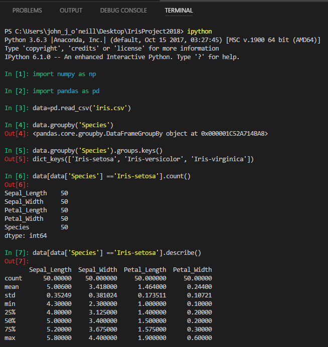
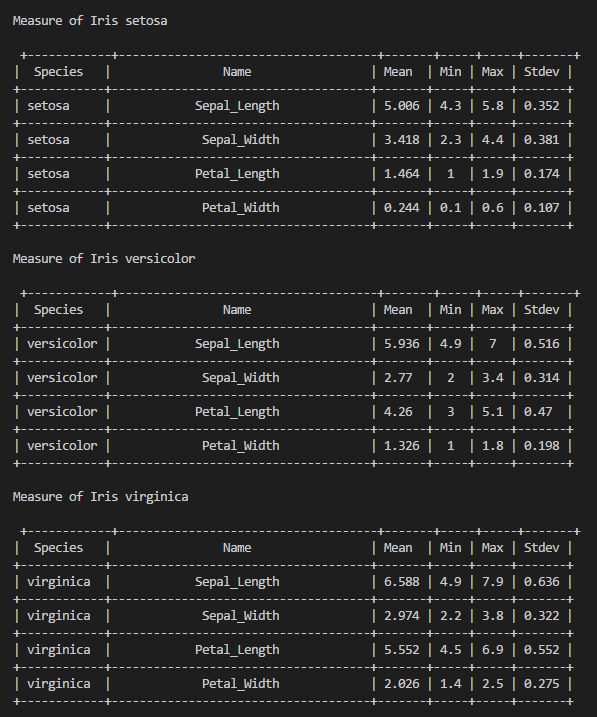
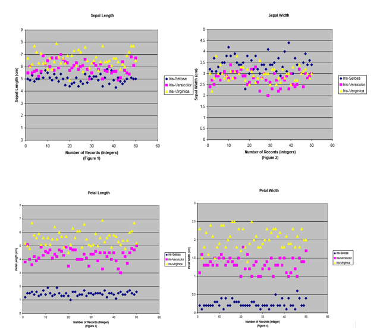
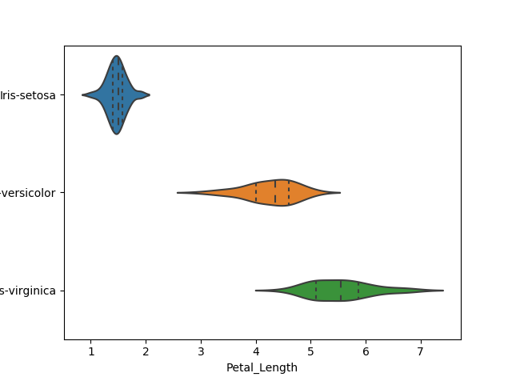
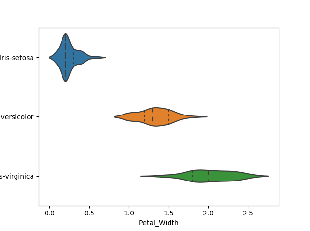
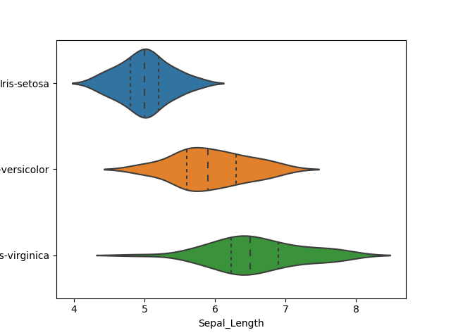
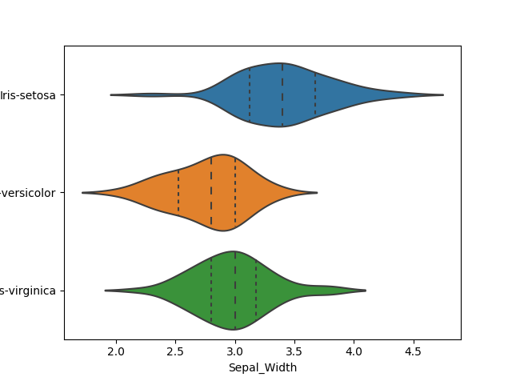

 
## IrisProject2018 Programming and Scripting Module Project
### Introduction

This project sets out to investigate the [Iris Dataset](http://archive.ics.uci.edu/ml/machine-learning-databases/iris/)  using Python code learnt in the Module, and also to demonstrate that as the research/learnings progressed, new tools and functionality commonly used in Data Science/ Data Analyitics were highlighted and introduced to the workings.

Initially I used Python coding to calculate and display basic staistics on the dataset and push output to print/file output in a Tabular format. (used Mean, Min, Max and Standard Deviation as sample indicators of significant attributes).
Through further research I have since discovered [Pandas](https://pandas.pydata.org/), [NumPy](www.numpy.org/), [Mathplotlib](https://matplotlib.org/) and [seaborn](https://seaborn.pydata.org) as useful and more effective/efficient means of data mining as well as producing highly effective visualistion of the data.

The drill down on the dataset and resultant graphics make it evident there are attributes to the species of Iris that indicate common groupings that lend themselves as predictors of species type dependent on the characteristics of the 4 variables.

It is also clear why the Iris dataset is commonly used as sample data to demonstrate Machine learning and related subjects as it profiles characteristics that lend themselves to "predict" a Species type dependent on the variable measured.
The guiding principle here is that "Data Science or data analysis is the process of analyzing a large dset of data points to get answers on questions related to tht data" [YouTube](https://www.youtube.com/watch?v=CmorAWRsCAw)
The key to good data analytics it is argued is that stored information is most useful when it is used to produce new information of value... it the case of the Iris, the various lenghts , widths etc. of a given petal should "predict" what particular species of the plant is at hand.

"in comparing methods old and new, and in evaluating any method, it is often considered helpful to try them out on known datasets, thus maintaining some continuity in how we assess methods"
https://stats.stackexchange.com/questions/74776/what-aspects-of-the-iris-data-set-make-it-so-successful-as-an-example-teaching

### Background Information.
 The Iris Dataset is a sample of data collected at the time for  R.A. Fisher's 1936 paper, "The Use of Multiple Measurements in Taxonomic Problems". The data set contains measures of 4 variables on 3 Species of the Iris plant(Iris setosa, Iris virginica and Iris versicolor). The four measures are: the length and the width of the sepals and petals, in centimetres. (https://en.wikipedia.org/wiki/Iris_flower_data_set). The sample size is 150.

### So in summary:
1. Sample Size = 150
2. Variables measured ("Inputs") = 4 (length and the width of the sepals and petals, in centimetres)
3. Species ("Outputs") = 3 ...setosa, versicolor, virginica

Source data was verified for accuracy from the Iris.csv input file.

  
## Inital Findings/Observations.
[First Statistics file](Simplemeasuresr4.py)  pulled the Iris dataset from a csv file and calculated out the Mean, Min, Max, and Standard Deviations for each of the 4 variables at a top level and for each of the Species. The output file for this is [here](Output_of_SimpleMeasure_code.txt)
 

### Table 1:Measures of Variables

 
After discovering the Numpy & Panda modules, I was able to pull the required data in a much cleaner manner. 
[Summary Output file](Summary.txt)  of the [Python script](Applying_pandas_on_Iris_Table.py)  
 
##### Sepal Length
Species|Mean|Min|Max|StDev|
 ---|---|---|---|---|
Iris-setosa|	5.006|	4.3	|5.8|0.3524
Iris-versicolor|	5.936|	4.9|	7|0.5161 
Iris-virginica|	6.588|	4.9	|7.9|0.6358

##### Sepal Width
Species|Mean|Min|Max|StDev|
---|---|---|---|---|
Iris-setosa|	3.418|	2.3|	4.4|0.3810 
Iris-versicolor|	2.77|	2	|3.4|0.3137
Iris-virginica	|2.974|	2.2|	3.8|0.3224 

##### Petal Length
Species|Mean|Min|Max|StDev
|---|---|---|---|---|
Iris-setosa|	1.464|	1	|1.9|0.1735
Iris-versicolor|	4.26	|3	|5.1|0.4699
Iris-virginica	|5.552|	4.5|	6.9|0.5518

##### Petal Width
Species|Mean|Min|Max|StDev|
---|---|---|---|---|
Iris-setosa|	0.244|	0.1|	0.6|0.1072
Iris-versicolor|	1.326|	1	|1.8|0.1977
Iris-virginica|	2.026	|1.4|	2.5|0.2746

 
As a first pass review of the data output one can make certain observations to prompt further review.
 
Sepals: Average Length of the setosa is generlly smaller that versicolor and virginica, which are close in measure. The oppsite applies o the Sepal Widths. In this case the data shows setosa to be signigicantly wider that both alternatives
... setosa petal shown to be "short and wide", while the other 2 are "long and narrow"

Petals: The average length of setosa is significantly shorter at a maximum lenght of 1.9cm. In contrast the shortest of verisolcor and virginica are substantially longer that the setosa at 3cm and 4.5cm respectively.Also the width of the setosa species is heavily contrasted to its fellow Iris species.
... setosa is both substantially shorter and narrower than verisolcor and virginica

Producing visualisations of the data measure further helps demonstate the gaps in relative size.
Data Visualisation is very important in that it is used continuously to explore the data set and prodive useful insights and to share them in an effective way. Producing Visualisations of the data measure further helps demonstate the gaps in relative sizes.

 
 
Hoey's data reproduced here clearly demonstrates this also. 

As he calls out;
"Sepal length :virginica has the longest sepals,versicolor the medium length and setosa has the shortest
 Sepal width:setosa has the widest sepals,virginica the medium and versicolor has the narrowest of sepals 

Petal length: virginica has the longest petals, versicolor the medium length, and setosa has the shortest petals
... as hoey also points out the "points are partitioned pretty 	cleanly with little overlap" (Hoey)

Petal width :Iris-Virginica has the widest petals, versicolor medium width,setosa the narrowest petals when compared to the other classes. "

These seaborn examples with code extracted from the tutorials visually illustrate these variations vey well.
  
 
 
 
 
 
 
 
#### Linear Discriminant Analysis
Based on the feature of the 4 variables, Fisher developed a Linear dicriminant model to distinguish the species from eachother.
The goal of a discriminant analysis is to produce a simple function that, given the four measurements, will classify a flower correctly. This is the beginning of creating “predictors” in order to try to make a more educated guess on a record in a dataset.... the basis of machine learning.

In "Linear Discriminant Analysis for Machine Learning"(1) By Jason Brownlee on April 6, 2016 in Machine Learning Algorithms (https://machinelearningmastery.com/linear-discriminant-analysis-for-machine-learning/) The (bold)Linear discriminant analysis (LDA) is seen as the preferred linear classification technique where you have more than two classes. Statistical data derived from available data is used to make predictions based on LDA equations based on certain assumptions. The statistical tools uses already known groups assignments "to assign objects to one group among a number of groups.https://www.researchoptimus.com/article/what-is-descriminant-analysis.php

#### Data Mining
The data set is used demonstrating machine learning is what is described as "Supervised Learning". There is a clear relationship between the known input data available and the expected outputs.
 
#### Learnings

In the course of working through Python coding to interogate the data for trends in the data and through researching available functions , modules etc. that surfaced during that effort, it has become apparent there are numerous modules and Python "Add-ons" that make the Data Analysis effort much easier and user friendly for the beginner "Programmer". Inital attempts to calculate the Statistical measures were "clumsy"... lenghty code and messy looking data tables.It became quickly apparent to me that running a Histogram for all the data combined does not add significant value, only comparisons between the Species and their characterisics demonstartes the relationships and groupings of measures dependent on the variables.

This project has reinforced the abolute need to become mfamiliar with Data Analysis tools supported by Python such as Numpy, Pandas, matplotlib.pyplot, and seaborn. In order to improve the apparance of outputted data I have come accross modules that helped in various searches and tuturials 

   
The use of Data Analysis tools available provide many advantages
Python modules provide a speedy method of completing complex mathematical computations and outputting not only deatial historical data but also provides a means to recommend/take further action based on new inputs.     
 
References:Examples and tutorials on how to create histograms and Scatterplots. Based on researching the Data Set the scattergram type graphs are effective illustrations for the 3 different Species of Iris speciments.

#### key learnings and references in code taken from these sites 
#### These are references are specifically called out in the command files

https://www.shanelynn.ie/summarising-aggregation-and-grouping-data-in-python-pandas/
https://www.pythonprogramming.net/data-analysis-python-pandas-tutorial-introduction/
https://matplotlib.org/tutorials/introductory/sample_plots.html#sphx-glr-tutorials-introductory-sample-plots-py
https://www.kaggle.com/jchen2186/machine-learning-with-iris-dataset/notebook
https://seaborn.pydata.org/tutorial/distributions.html?highlight=scatterplot
https://pandas.pydata.org/pandas-docs/stable/groupby.html 
http://seaborn.pydata.org/generated/seaborn.pairplot.html 
https://www.kaggle.com/lalitharajesh/iris-dataset-exploratory-data-analysis
https://www.pythonprogramming.net/

#### References
https://en.wikipedia.org/wiki/Iris_flower_data_set

https://machinelearningmastery.com/linear-discriminant-analysis-for-machine-learning/

[Statistical Analysis of the Iris Flower Dataset, University of Massachusetts At Lowell]
(http://patrickhoey.com/downloads/Computer_Science/03_Patrick_Hoey_Data_Visualization_Dataset_paper.pdf)

"Linear Discriminant Analysis for Machine Learning"(1) By Jason Brownlee on April 6, 2016 in Machine Learning Algorithms (https://machinelearningmastery.com/linear-discriminant-analysis-for-machine-learning/)

https://www.researchoptimus.com/article/what-is-descriminant-analysis.php
   
